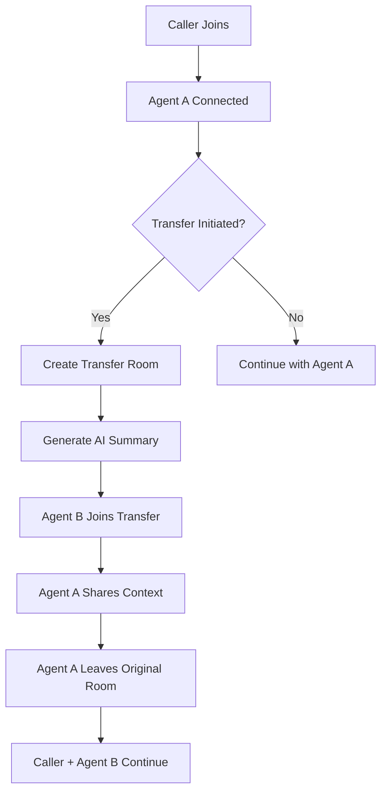

# 🔄 Advanced Warm Transfer System with LiveKit & LLM

A sophisticated real-time warm transfer application built with LiveKit, Next.js, Python, and AI-powered call summarization.

## 🚀 Features

### Core Features
- **Seamless Warm Transfer**: Agent A → Agent B with context preservation
- **AI-Powered Call Summaries**: Real-time LLM integration for context generation
- **LiveKit Integration**: Real-time audio/video communication
- **Modern UI**: React-based dashboard with real-time updates

### Advanced Features
- **Call Recording & Playback**: Automatic recording with cloud storage
- **Real-time Transcription**: Live call transcription with sentiment analysis
- **Multi-Agent Queue System**: Smart agent routing and availability management
- **Analytics Dashboard**: Call metrics, transfer success rates, agent performance
- **Custom Agent Personalities**: Configurable AI agent behaviors
- **Call Escalation Matrix**: Intelligent routing based on call complexity
- **WebRTC Screen Sharing**: Advanced collaboration features
- **Real-time Chat**: Text messaging during calls

### Optional Twilio Extension
- **PSTN Integration**: Transfer to real phone numbers
- **SIP Support**: Enterprise telephony integration
- **SMS Notifications**: Call status updates via SMS

## 🛠 Tech Stack

- **Frontend**: Next.js 14, TypeScript, Tailwind CSS, Socket.IO
- **Backend**: Python 3.11, FastAPI, WebSockets, SQLAlchemy
- **Real-time**: LiveKit Server SDK, WebRTC
- **AI/LLM**: OpenAI GPT-4, Groq Llama, OpenRouter
- **Database**: PostgreSQL, Redis for caching
- **Optional**: Twilio Voice API, SIP.js

## 📋 Prerequisites

- Node.js 18+
- Python 3.11+
- LiveKit Cloud account (free tier available)
- LLM API key (OpenAI/Groq/OpenRouter)
- PostgreSQL database
- Redis server
- Optional: Twilio account for PSTN integration

## 🔧 Installation

### 1. Clone Repository
```bash
git clone <your-repo-url>
cd wire-transfer-implementation
```

### 2. Backend Setup
```bash
cd backend
python -m venv venv
# Windows
venv\Scripts\activate
# Linux/Mac
source venv/bin/activate

pip install -r requirements.txt
```

### 3. Frontend Setup
```bash
cd frontend
npm install
```

### 4. Environment Configuration
```bash
# Backend (.env)
cp .env.example .env
# Fill in your API keys and configuration

# Frontend (.env.local)
cp .env.local.example .env.local
# Add your frontend environment variables
```

### 5. Database Setup
```bash
cd backend
python scripts/init_db.py
```

## 🚀 Running the Application

### Development Mode
```bash
# Terminal 1 - Backend
cd backend
uvicorn main:app --reload --port 8000

# Terminal 2 - Frontend
cd frontend
npm run dev

# Terminal 3 - LiveKit Server (if self-hosting)
livekit-server --dev
```

### Production Mode
```bash
# Build frontend
cd frontend
npm run build

# Run with PM2 or Docker
docker-compose up -d
```

## 📖 Usage

### 1. Access the Dashboard
Navigate to `http://localhost:3000` to access the main dashboard.

### 2. Start a Call
- Click "Start Call" to join as a caller
- Agent A will automatically connect
- Use the transfer button to initiate warm transfer

### 3. Warm Transfer Flow
1. Agent A receives the call
2. Agent A clicks "Initiate Transfer"
3. System generates AI call summary
4. Agent B joins the transfer room
5. Agent A shares context with Agent B
6. Agent A leaves, completing the transfer

## 🔄 Warm Transfer Workflow



## 🎯 API Endpoints

### Core Transfer API
- `POST /api/v1/calls/start` - Start new call
- `POST /api/v1/transfers/initiate` - Start warm transfer
- `GET /api/v1/transfers/{transfer_id}/status` - Transfer status
- `POST /api/v1/transfers/{transfer_id}/complete` - Complete transfer

### Analytics API
- `GET /api/v1/analytics/calls` - Call statistics
- `GET /api/v1/analytics/agents` - Agent performance
- `GET /api/v1/analytics/transfers` - Transfer metrics

## 🔐 Security Features

- JWT authentication for agents
- End-to-end encryption via LiveKit
- Rate limiting on API endpoints
- CORS configuration
- Input validation and sanitization

## 🎮 Demo Instructions

1. **Setup**: Follow installation instructions
2. **Agent Dashboard**: Open multiple browser tabs for Agent A and Agent B
3. **Caller Interface**: Use incognito mode for caller simulation
4. **Transfer Demo**: Initiate transfer and observe AI summary generation
5. **Analytics**: Check real-time metrics on dashboard

## 📊 Monitoring & Analytics

The system includes comprehensive monitoring:
- Real-time call metrics
- Transfer success rates
- Agent availability tracking
- Call quality analytics
- AI summary effectiveness metrics

## 🧪 Testing

```bash
# Backend tests
cd backend
pytest

# Frontend tests
cd frontend
npm test

# E2E tests
npm run test:e2e
```

## 🔧 Configuration

### LiveKit Configuration
```yaml
# livekit.yaml
port: 7880
bind_addresses: ["0.0.0.0"]
rtc:
  tcp_port: 7881
  port_range_start: 50000
  port_range_end: 60000
```

### AI Model Configuration
```python
# config/ai_models.py
MODELS = {
    "openai": {
        "model": "gpt-4-turbo-preview",
        "max_tokens": 500
    },
    "groq": {
        "model": "llama3-70b-8192",
        "max_tokens": 500
    }
}
```

## 🚀 Deployment

### Docker Deployment
```bash
docker-compose up -d
```

### Cloud Deployment
- Frontend: Vercel/Netlify
- Backend: Railway/Render/AWS
- Database: Supabase/PlanetScale
- LiveKit: LiveKit Cloud

## 📝 Contributing

1. Fork the repository
2. Create feature branch
3. Commit changes
4. Push to branch
5. Create Pull Request

## 📄 License

MIT License - see LICENSE file for details

## 🙋‍♂️ Support

For questions or issues:
- GitHub Issues: [Project Issues](link)
- Email: support@warmtransfer.app
- Documentation: [Full Docs](link)

---

Built with ❤️ using LiveKit, Next.js, and AI